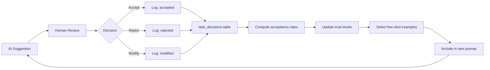

# Learning Flywheel

The learning flywheel is MDD HQ's feedback loop mechanism. Every human decision on an AI suggestion -- accept, reject, or modify -- is logged and used to improve future AI suggestions. Over time, the system calibrates its confidence and adapts its behavior based on the patterns in human decisions.

## How It Works

The flywheel operates as a continuous cycle:

1. **AI suggests** - An executor produces a classification, draft, or recommendation
2. **Human decides** - The user accepts, rejects, or modifies the suggestion
3. **Decision is logged** - The decision and context are stored in `task_decisions`
4. **Patterns are analyzed** - Acceptance rates and modification patterns are computed
5. **Future suggestions adapt** - Past decisions are included as few-shot context in future prompts
6. **Confidence calibrates** - The system's confidence scores align with actual acceptance rates



## task_decisions Table

Every human decision is stored in the `task_decisions` table:

| Column | Type | Description |
|---|---|---|
| `id` | uuid | Primary key |
| `task_id` | uuid | Reference to the task |
| `queue_id` | uuid | Reference to the task_queue record |
| `executor_type` | text | Which executor produced the suggestion |
| `decision` | text | accepted, rejected, or modified |
| `ai_suggestion` | jsonb | What the AI suggested |
| `human_result` | jsonb | What the human actually chose (for modified decisions) |
| `context` | jsonb | Additional context at decision time |
| `created_at` | timestamp | When the decision was made |

### What Gets Logged

For each decision type:

**Accepted:**
- The AI suggestion is logged as both `ai_suggestion` and the effective result
- Context includes the task source, type, and any filter state

**Rejected:**
- The AI suggestion is logged in `ai_suggestion`
- `human_result` is null (the suggestion was discarded entirely)
- Context includes the rejection reason if provided

**Modified:**
- The AI suggestion is logged in `ai_suggestion`
- `human_result` contains what the user changed it to
- The diff between suggestion and result is computable from these two fields

## Acceptance Rates

The flywheel system computes acceptance rates per executor type and per classification category. These rates reveal how well the AI is performing:

| Metric | Calculation | Use |
|---|---|---|
| Overall acceptance rate | accepted / total decisions | General AI health indicator |
| Per-executor acceptance rate | accepted / total for that executor | Identifies weak executors |
| Per-type acceptance rate | accepted / total for classify by type | Shows which types are classified well |
| Per-source acceptance rate | accepted / total by task source | Shows which sources need better classification |
| Trend (7-day rolling) | acceptance rate over last 7 days | Detects improvement or degradation |

:::info
A healthy flywheel shows acceptance rates above 70% and trending upward. Rates below 50% suggest the executor needs prompt tuning or the classification categories need adjustment.
:::

## Trust Levels

Trust levels are computed from acceptance rate history and determine how the UI presents AI suggestions:

| Trust Level | Acceptance Rate | UI Behavior |
|---|---|---|
| High | > 85% | Suggestion is pre-selected (user confirms with one click) |
| Medium | 60-85% | Suggestion is shown prominently but not pre-selected |
| Low | 40-60% | Suggestion is shown with a warning indicator |
| Very Low | < 40% | Suggestion is shown de-emphasized with explicit caution |

Trust levels are computed by the `flywheel.js` module and cached for quick access. They update on each new decision.

### Trust Level Computation

```js
// Simplified flywheel trust calculation
function computeTrustLevel(executorType) {
  const recentDecisions = getDecisions(executorType, { limit: 50 });
  const accepted = recentDecisions.filter(d => d.decision === 'accepted');
  const rate = accepted.length / recentDecisions.length;

  if (rate > 0.85) return 'high';
  if (rate > 0.60) return 'medium';
  if (rate > 0.40) return 'low';
  return 'very_low';
}
```

The window is the last 50 decisions for each executor type. This keeps the trust level responsive to recent behavior while being stable enough to avoid noise from individual decisions.

## Few-Shot Context

The most impactful part of the flywheel is the few-shot context injection into AI prompts. When an executor runs, it includes examples of recent human decisions as context for the AI.

### How Few-Shot Examples Are Selected

1. Query `task_decisions` for the target executor type
2. Filter to the most recent 3-5 decisions
3. Prioritize a mix of accepted and rejected decisions
4. Format each as an input/output example pair
5. Include in the executor's prompt as "Here are recent examples of how the user classified similar tasks"

### Example: Classification Few-Shot

When the classify executor runs for a new task, the prompt includes something like:

```
Recent classification decisions (use these to calibrate your suggestions):

Task: "Review PR #234 - API refactor"
AI suggested: type=dev, section=active, priority=high
User decision: ACCEPTED

Task: "Schedule Q2 planning meeting"
AI suggested: type=comms, section=active, priority=medium
User decision: MODIFIED -> type=manual, section=active, priority=low

Task: "Research competitor pricing models"
AI suggested: type=research, section=someday, priority=low
User decision: REJECTED (user moved to active with high priority)
```

This context helps the AI learn:
- The user treats PR reviews as high-priority dev tasks (confirmed)
- Meeting scheduling is manual, not comms (corrected)
- Research tasks may be more urgent than the AI estimates (pattern)

## Confidence Calibration

The flywheel calibrates confidence scores by comparing predicted confidence with actual acceptance:

| Predicted Confidence | Actual Acceptance | Adjustment |
|---|---|---|
| High (above 0.8) | Accepted | Confidence validated |
| High (above 0.8) | Rejected | Confidence should decrease |
| Low (below 0.5) | Accepted | Confidence should increase |
| Low (below 0.5) | Rejected | Confidence validated |

Over time, the confidence scores converge with reality -- a 0.8 confidence score means approximately 80% of similar suggestions are accepted. This calibration happens implicitly through the few-shot examples rather than through explicit model fine-tuning.

## Cold Start

When the system is new and has no decision history:

1. The classify executor uses generic prompts without few-shot examples
2. Trust levels default to "medium" for all executor types
3. Confidence scores are treated as uncalibrated
4. After approximately 20-30 decisions per executor, the flywheel produces meaningful patterns

:::note
The cold start period typically lasts 1-2 weeks of active use. During this period, expect lower acceptance rates as the system learns user preferences.
:::

## Flywheel Health Monitoring

The dev metrics page includes flywheel health indicators:

- **Decision volume** - Total decisions logged (higher is better for learning)
- **Acceptance trend** - 7-day rolling acceptance rate
- **Per-executor breakdown** - Which executors are performing well
- **Confidence calibration** - How well confidence predicts acceptance
- **Decision recency** - When the last decisions were logged (staleness indicator)

## Data Retention

Decision history is retained indefinitely. Older decisions carry less weight (the few-shot window uses recent examples), but the full history is available for analysis and trend computation. There is no automatic purge.

## Related Pages

- [Pipeline Overview](./overview) - Full pipeline flow
- [Executors](./executors) - Individual executor details
- [Task Processor](./task-processor) - How processing triggers decisions
- [Tasks Schema](../data/tasks-schema) - task_decisions table schema
