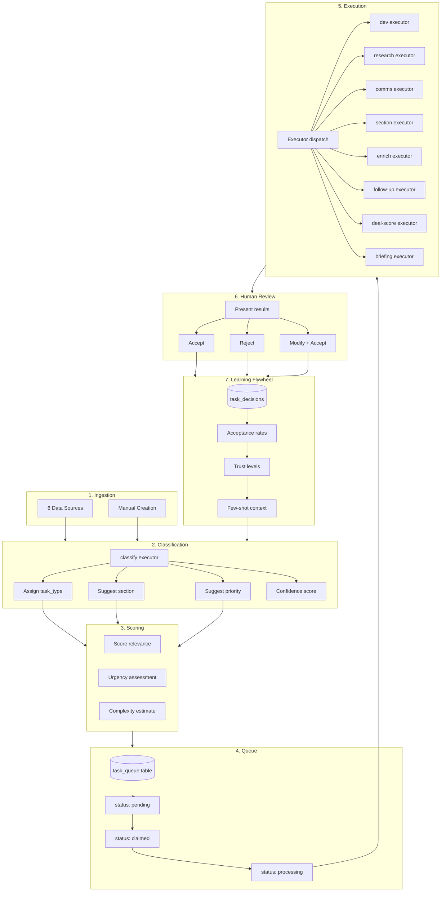

# AI Pipeline Overview

The MDD HQ AI pipeline is a structured system that processes tasks through classification, scoring, queueing, execution, and human review. Every AI action feeds into a learning flywheel that improves future suggestions based on human decisions.

## Pipeline Flow

## Pipeline Stages

### 1. Ingestion

Tasks enter the system from 6 data sources plus manual creation. Each source has a dedicated sync endpoint that normalizes data into the common task schema. See [Data Sources](../features/task-data-sources) for details.

### 2. Classification

New tasks are classified by the `classify` executor using Claude Haiku. Classification determines:

| Field | Options | Description |
|---|---|---|
| `task_type` | dev, comms, research, manual | What kind of work this task involves |
| `section` | active, waiting, someday | Where the task should live |
| `priority` | high, medium, low | How urgent/important the task is |
| `confidence` | 0.0 - 1.0 | How confident the AI is in its classification |

Classification uses few-shot context from past human decisions to improve accuracy over time.

### 3. Scoring

After classification, tasks receive relevance and urgency scores. These scores help prioritize which tasks to surface first and which AI actions to suggest.

### 4. Queue

When a user requests an AI action, it is added to the `task_queue` table with status `pending`. The queue provides:

- **Ordering** - Tasks are processed in FIFO order
- **Status tracking** - pending, claimed, processing, completed, failed
- **Progress reporting** - `progress_pct` and `current_step` fields for UI feedback
- **Error handling** - Failed tasks store error messages for debugging

### 5. Execution

The [Task Processor](./task-processor) cron runs every 5 minutes and processes one task at a time. It dispatches to the appropriate executor based on `task_type`.

### 6. Human Review

Results are presented to the user with accept/reject/modify options. The UI varies by executor type:

| Executor | Review UI |
|---|---|
| classify | Type/section/priority badges with accept/reject |
| dev | Technical spec with edit/accept/discard |
| research | Research summary with save/discard |
| comms | Email draft with edit/send/discard |
| section | Section suggestion with accept/reject |
| enrich | Enriched data with merge/discard |
| follow-up | Follow-up draft with edit/send/discard |
| deal-score | Score display (informational, auto-saved) |
| briefing | Briefing document with save/discard |

### 7. Learning Flywheel

Every human decision is logged to `task_decisions`. The flywheel system analyzes acceptance rates and adjusts future behavior. See [Learning Flywheel](./learning-flywheel) for the full feedback loop architecture.

## Executor Routing Table

The pipeline routes to executors based on the requested action type:

| Action | Executor | Model | Typical Latency |
|---|---|---|---|
| Classify task | `classify` | Claude Haiku | 1-2 seconds |
| Generate dev specs | `dev` | Claude Haiku | 3-5 seconds |
| Research topic | `research` | Claude Haiku | 5-10 seconds |
| Draft email | `comms` | Claude Haiku | 3-5 seconds |
| Suggest section | `section` | Claude Haiku | 1-2 seconds |
| Enrich contacts | `enrich` | Claude Haiku | 3-8 seconds |
| Draft follow-up | `follow-up` | Claude Haiku | 3-5 seconds |
| Score deal | `deal-score` | Claude Haiku | 2-4 seconds |
| Generate briefing | `briefing` | Claude Haiku | 5-10 seconds |

## Action Categories

AI actions fall into 3 categories with different human review requirements:

### Informational (Low Risk)
Actions that produce read-only information. The user can save or discard but nothing changes externally.

- Task classification
- Deal scoring
- Research summaries
- Client briefings

### Data Modification (Medium Risk)
Actions that modify internal data. The user must explicitly confirm before changes are applied.

- Section changes
- Contact enrichment
- Task type reclassification

### External Communication (High Risk)
Actions that could send messages to other people. These have the strictest controls.

- Email drafts (NEVER auto-sent)
- Follow-up drafts (NEVER auto-sent)

:::warning
The system never auto-sends any external communication. Email and follow-up drafts are always presented for human review, editing, and explicit send action.
:::

## Configuration

| Setting | Value | Description |
|---|---|---|
| Processing interval | 5 minutes | How often the task-process cron runs |
| Batch size | 1 | Tasks processed per cron cycle |
| Model | Claude Haiku | AI model for all executors |
| Auto-enrich on sync | Configurable | `AUTO_ENRICH_ON_SYNC` env var |
| AI feature flag | `CONSULTING_AI_FEATURES` | Must be ON for consulting AI |

## Related Pages

- [Task Processor](./task-processor) - Cron processing details
- [Executors](./executors) - Individual executor documentation
- [Learning Flywheel](./learning-flywheel) - Feedback loop architecture
- [AI Automation](../features/ai-automation) - Feature-level AI overview
