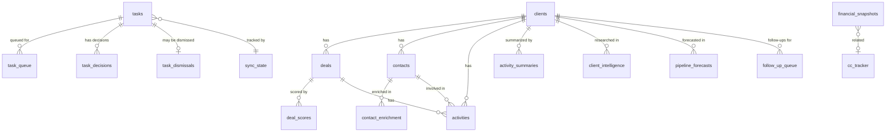

# Schema Overview

MDD HQ uses 15+ Supabase (PostgreSQL) tables organized into 4 domain clusters. This page provides an entity-relationship overview and table inventory.

## Entity-Relationship Diagram

## Table Inventory

### Tasks Domain

Tables that power the task management system, AI pipeline, and sync infrastructure.

| Table | Purpose | Primary Key | Key Relationships |
|---|---|---|---|
| `tasks` | Core task records from all sources | `id` (uuid) | Source of task_queue, task_decisions |
| `task_queue` | AI processing queue | `id` (uuid) | References tasks |
| `task_decisions` | Human decisions on AI suggestions | `id` (uuid) | References tasks, task_queue |
| `task_dismissals` | Dismissed synced tasks (prevent re-import) | `source_id` (text) | Keyed by source identifier |
| `sync_state` | Last sync timestamps per source | `source` (text) | Tracks sync freshness |

### CRM Domain

Tables that power the consulting portal, client management, and activity tracking.

| Table | Purpose | Primary Key | Key Relationships |
|---|---|---|---|
| `clients` | Client company records | `id` (uuid) | Parent of deals, contacts, activities |
| `deals` | Deal/opportunity records | `id` (uuid) | Belongs to client |
| `contacts` | Contact/person records | `id` (uuid) | Belongs to client |
| `activities` | Activity log entries (meetings, emails, calls) | `id` (uuid) | Belongs to client and/or deal |
| `activity_summaries` | AI-generated activity summaries | `id` (uuid) | Belongs to client |

### AI Intelligence Domain

Tables that store AI-generated insights, scores, and enrichment data.

| Table | Purpose | Primary Key | Key Relationships |
|---|---|---|---|
| `client_intelligence` | AI research results per client | `id` (uuid) | Belongs to client |
| `deal_scores` | AI deal health scores | `id` (uuid) | Belongs to deal |
| `pipeline_forecasts` | Revenue forecast data | `id` (uuid) | Belongs to client |
| `contact_enrichment` | AI-enriched contact data | `id` (uuid) | Belongs to contact |
| `follow_up_queue` | Pending follow-up drafts | `id` (uuid) | Belongs to client |

### Financial Domain

Tables for personal finance tracking and credit card management.

| Table | Purpose | Primary Key | Key Relationships |
|---|---|---|---|
| `financial_snapshots` | Point-in-time financial data | `id` (uuid) | Standalone |
| `cc_tracker` | Credit card reward tracking | `id` (uuid) | Standalone |

### Other

| Table | Purpose | Primary Key |
|---|---|---|
| `chat_messages` | Chat/messaging data | `id` (uuid) |

## Domain Cluster Details

### Tasks Cluster

The tasks cluster is the most interconnected. The `tasks` table is central -- it feeds into the `task_queue` for AI processing, receives decisions back via `task_decisions`, tracks dismissals in `task_dismissals`, and uses `sync_state` to manage external source synchronization.

Key patterns:
- Tasks from external sources use `source` + `source_id` for deduplication
- The `task_meta` JSONB field stores AI classification data and sync conflict information
- `task_queue` records have a lifecycle: pending -> claimed -> processing -> completed/failed
- `task_decisions` creates an audit trail of every human decision on AI suggestions

### CRM Cluster

The CRM cluster follows a standard business data model. `clients` is the parent entity with `deals`, `contacts`, and `activities` as child records. The `activity_summaries` table stores AI-generated summaries of activity clusters.

Key patterns:
- Deals track stage transitions and expected close dates
- Contacts are linked to clients by company
- Activities can be linked to both a client and a specific deal
- Activity summaries aggregate multiple activities into digestible overviews

### AI Intelligence Cluster

The intelligence cluster stores outputs from AI executors. Each table is linked to a CRM entity (client, deal, or contact) and contains AI-generated insights.

Key patterns:
- `client_intelligence` accumulates over time -- each research run adds new entries
- `deal_scores` are timestamped for trend analysis
- `contact_enrichment` can be refreshed in batch by company
- `follow_up_queue` entries are consumed (sent or discarded) and replaced

### Financial Cluster

The financial cluster is intentionally isolated from other domains. Financial data has its own sync mechanism (local-only Monarch Money sync) and its own privacy controls.

Key patterns:
- `financial_snapshots` stores point-in-time data, not running balances
- The `cc_tracker` table is independent of financial snapshots
- Both tables have simple schemas without foreign key relationships

## Schema Conventions

All tables follow these conventions:

| Convention | Description |
|---|---|
| Primary key | UUID `id` column (except `task_dismissals` which uses `source_id`) |
| Timestamps | `created_at` and `updated_at` on all tables |
| JSONB fields | Used for flexible metadata (`task_meta`, `params`, `accounts`) |
| Text enums | String columns with application-level validation (not DB enums) |
| RLS policies | All tables have Row-Level Security enabled |
| Naming | snake_case for all table and column names |

## Related Pages

- [Tasks Schema](./tasks-schema) - Detailed column documentation for task tables
- [Supabase Integration](../integrations/supabase) - Database patterns and real-time
- [Consulting Portal](../features/consulting-portal) - CRM features and tables
- [Financial Health](../features/financial-health) - Financial data details
