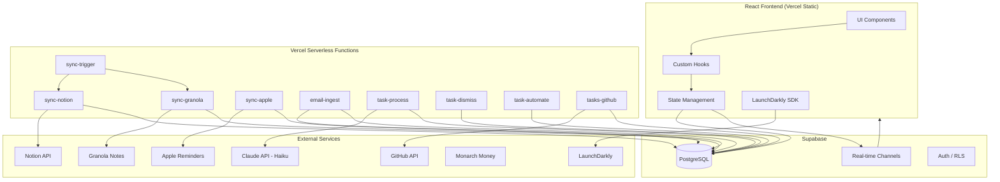
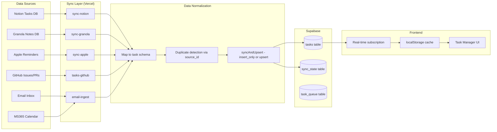
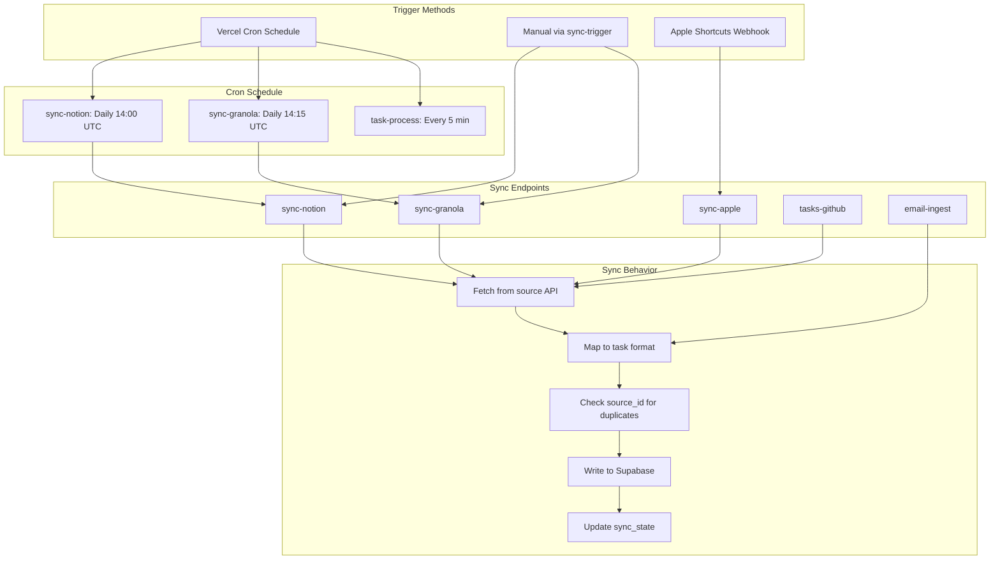
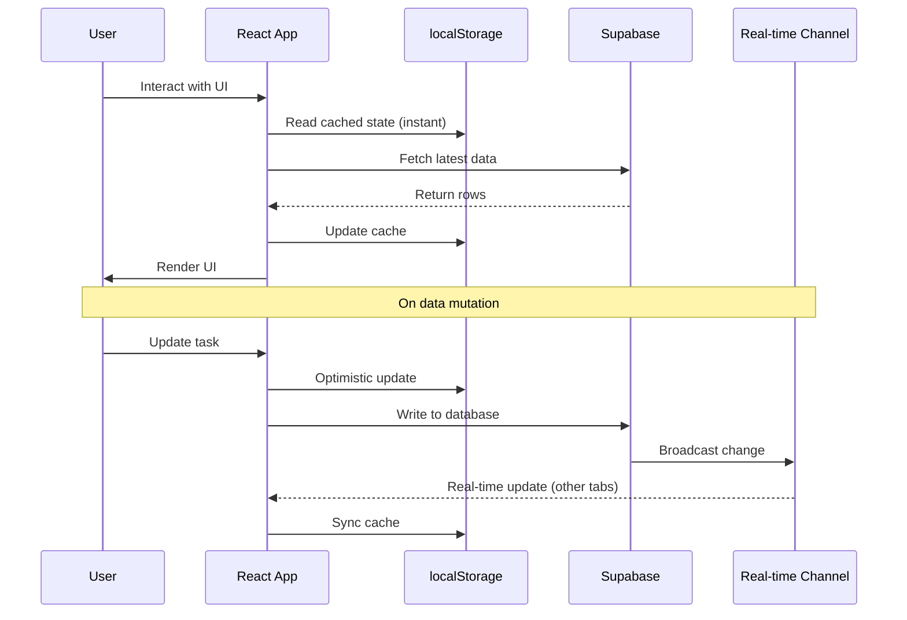

# Architecture

MDD HQ follows a client-heavy architecture where the React frontend handles most business logic, with Vercel serverless functions providing data ingestion, sync orchestration, and AI processing. Supabase serves as the persistence and real-time layer.

## System Overview



## Data Flow

This diagram shows how data moves from external sources through the serverless layer into Supabase, and then to the frontend via real-time subscriptions.



## Sync Architecture

The sync system uses a combination of scheduled crons and on-demand triggers. Each sync endpoint is idempotent -- running it multiple times produces the same result.



## Request Lifecycle

A typical request from the frontend follows this path:



## Key Architecture Patterns

### State Management: Three-Layer Pattern

MDD HQ does not use Redux or any global state library. Instead, it uses a three-layer pattern:

1. **localStorage** - Provides instant load and offline capability. Tasks, preferences, and UI state are cached locally.
2. **Supabase** - Source of truth for all persistent data. Reads and writes go through the Supabase JS client.
3. **Real-time channels** - Supabase WebSocket subscriptions push changes to all open tabs. Conflict resolution uses `updated_at` timestamps -- newest write wins.

### Authentication: Owner-Only Access

MDD HQ is a single-user application. Authentication uses an `isOwner` flag rather than a full user management system. Supabase Row-Level Security (RLS) policies restrict all table access to the authenticated owner.

### Feature Flags: LaunchDarkly Integration

The LaunchDarkly React SDK evaluates feature flags client-side. The `useFeatureFlag` hook and `FeatureGate` component wrap flag checks throughout the application. Security-sensitive flags (like `PERSONAL_FINANCE` and `CONSULTING_AI_FEATURES`) default to OFF.

### Error Boundaries and Fallbacks

Each major feature area has its own error boundary. If the consulting portal crashes, it does not take down the task manager. Static JSON fallbacks exist for features like financial health, so the UI remains usable even when external data sources are unavailable.

## Context Providers

The app uses React context providers for cross-cutting concerns:

| Context | Purpose |
|---|---|
| `SupabaseProvider` | Database client and auth state |
| `ThemeProvider` | Dark/light mode management |
| `FeatureFlagProvider` | LaunchDarkly flag evaluation |
| `FinancialDataProvider` | Financial data with privacy gate |
| `CommandPaletteProvider` | Cmd+K command palette state |
| `KeyboardShortcutProvider` | Global keyboard shortcut registry |
| `ToastProvider` | Notification and undo toasts |

## Directory Structure

```
src/
  components/       # Shared UI components
  features/         # Feature-specific modules
    tasks/           # Task manager
    consulting/      # CRM portal
    financial/       # Financial health
    cc-tracker/      # Credit card tracker
  hooks/             # Custom React hooks
  contexts/          # React context providers
  utils/             # Shared utilities
  data/              # Static data and constants
api/
  sync-trigger.js    # Orchestrator
  sync-notion.js     # Notion sync
  sync-granola.js    # Granola sync
  sync-apple.js      # Apple Reminders sync
  email-ingest.js    # Email ingestion
  task-process.js    # AI task processor
  task-dismiss.js    # Task dismissal
  task-automate.js   # Task automation
  tasks-github.js    # GitHub sync
  _lib/              # Shared server utilities
```

## Related Pages

- [Tech Stack](./tech-stack) - Detailed technology breakdown
- [Supabase Integration](../integrations/supabase) - Database and real-time details
- [API Overview](../api/overview) - Serverless endpoint reference
- [AI Pipeline Overview](../ai-pipeline/overview) - AI processing architecture
